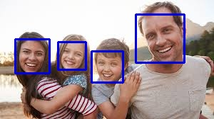

# Face Detection using Haar Cascades

This script demonstrates how to perform face detection using the Haar cascade classifier in OpenCV. It detects faces in an image and draws rectangles around them to highlight the detected faces.

## Requirements

- Python 3.x
- OpenCV library (`cv2`)

## Installation

1. Make sure you have Python 3.x installed. If not, download and install it from [python.org](https://www.python.org/).
2. Install the OpenCV library using pip:
    ```bash
    pip install opencv-python
    ```

## Usage

1. Clone the repository:
    ```bash
    git clone https://github.com/your_username/your_repository.git
    ```
2. Navigate to the project directory:
    ```bash
    cd your_repository
    ```
3. Place the script (`face_detection.py`) in your project directory.
4. Make sure you have an image file named `test3.jpg` in the same directory.
5. Download the pre-trained Haar cascade classifier file `haarcascade_frontalface_default.xml` from OpenCV's GitHub repository or other reliable sources and place it in the same directory.
6. Run the script:
    ```bash
    python face_detection.py
    ```
7. The script will display the input image with detected faces highlighted by rectangles.
8. Press any key to close the image window.
9. The script will save the image with detected faces as `face_detected3.jpg` in the same directory.

   

## Customization

- You can adjust the parameters of the `detectMultiScale` function for fine-tuning the face detection sensitivity.
- Modify the input image file name (`'test3.jpg'`) and output image file name (`'face_detected3.jpg'`) according to your needs.
- Ensure that the Haar cascade classifier file (`'haarcascade_frontalface_default.xml'`) is correctly loaded.

## Notes

- This script is a basic example of face detection using Haar cascades. For more advanced applications, consider using deep learning-based approaches such as Convolutional Neural Networks (CNNs).
